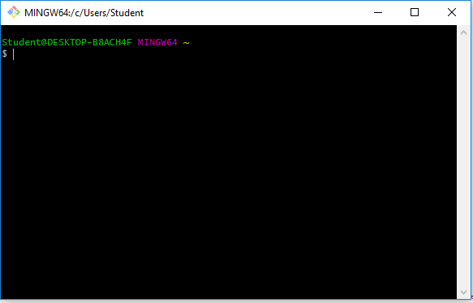

# Instalasi Git

git yang digunakan pada instalasi ini adalah git versi 2.16.2, sehingga pertama yang harus disiapkan adalah file untuk menginstall.

Langkah - Langkah Instalasi Git di Windows

1. Klik dua kali file git.exe, kemudian klik next

2. Langkah berikutnya akan memilih lokasi instalasi, default akan terisi *C:\Program Files\Git*, apabila menginginkan lokasi lain maka dapat memilih lokasi yang diinginkan.

3. Memilih Komponen, pada tahapan ini tidak perlu mengubah apa yang sudah ada, ikuti default saja, kemudian klik next

4. Mengisi shortcut untuk menu Start. Gunakan default yaitu (Git), namun apabila ingin mengganti diperbolehkan

5. Pilih editor yang akan digunakan bersama dengan git

![05] (images/5.png)

6. Kemudian akan muncul pilihan command line yang dapat mengakses git, pilih pilihan kedua agar dapat menggunakan dua antar muka.

7. Pilih OpenSSL untuk HTTPS. 

8. Pilih pilihan pertama untuk konversi akhir baris (CR-LF).

9. Pilih MinTTY untuk terminal yang digunakan untuk mengakses Git Bash.

10. Untuk opsi ekstra, pilih serta aktifkan 1 dan 2.

11. Setelah itu proses instalasi akan dilakukan.

12. Jika selesai akan muncul dialog pemberitahuan. Klik pada **Finish**.

13. Untuk menjalankan, dari Start menu, ketikkan "Git", akan muncul beberapa pilihan. Pilih "Git Bash" atau "Git GUI".
 

14. Tampilan jika akan menggunakan "Git Bash"

15. Tampilan jika akan menggunakan "Git GUI"

16. Untuk mencoba dari command prompt, masuk ke command prompt, setelah itu eksekusi "git --version" untuk melihat apakah sudah terinstall atau belum. Jika sudah terinstall dengan benar, makan akan muncul hasil berikut:

