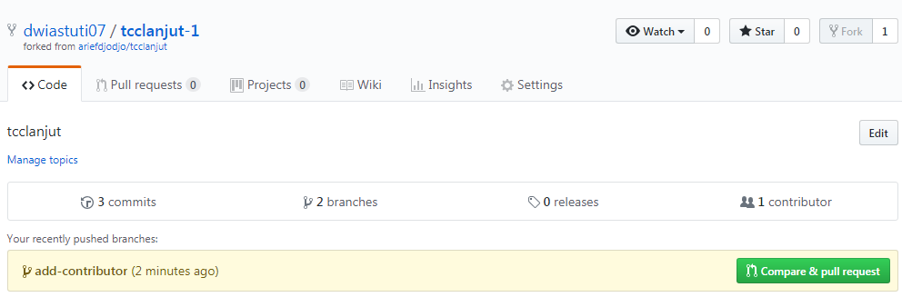

#minggu-02
# Kolaborasi Git

## Pendahuluan

Selain untuk mengelola aset digital milik diri sendiri, kita bisa menggunakan Git untuk berkolaborasi dalam suatu repo di GitHub yang bisa diakses bersama. Dalam kasus seperti ini, berarti ada 2 peran:

1. Pemilik repo, sering disebut sebagai *upstream author*.
2. Kontributor, yaitu orang-orang yang akan berkontribusi memberikan konten.

Untuk situasi seperti ini, diasumsikan:

1. *Upstream author* telah membuat repo git di GitHub
2. Kontributor telah mengetahui adanya repo tersebut, tertarik untuk berkontribusi, sudah mengetahui apa yang akan diberikan ke proyek (repo GitHub *upstream author*) tersebut.
3. Pembahasan selanjutnya adalah tentang bagaimana kontributor bisa mengirimkan kontribusi ke repo GitHub milik *upstream author*.

Dalam pembahasan ini:

1. *Upstream author* adalah *ariegdjodjo*.
2. Kontributor adalah *dwiastuti07*
3. Repo dari *upstream author* adalah **tcclanjut** yang bisa diakses di [https://github.com/ariefdjodjo/tcclanjut](https://github.com/ariefdjodjo/tcclanjut)

## Fork

Fork adalah membuat clone dari suatu repo di GitHub milik *upstream author*, diletakkan ke milik kontributor. Fork hanya dilakukan sekali saja. Pada dasarnya, proses untuk fork ini meliputi:

1. Fork repo di web GitHub.
2. Clone fork tersebut di komputer lokal.

Kontributor harus mem-*fork* repo *upstream author* sehingga di repo kontributor muncul repo tersebut. Proses *forking* ini dijelaskan dengan langkah-langkah berikut:

1. Login ke GitHub
2. Akses repo yang akan di-*fork*: https://github.com/ariefdjodjo/tcclanjut
3. Pada sisi kanan atas, klik Fork:


4. Pilih akan ditempatkan di account mana.
5. Setelah proses, repo dari *upstream author* sudah berada di account GitHub kita (kontributor)


Setelah proses tersebut, clone di komputer lokal:

```bash
$ git clone https://github.com/dwiastuti07/tcclanjut-1
```


Setelah itu, konfigurasikan repo lokal kontributor. Pada kondisi saat ini, di komputer lokal sudah terdapat repo `tcclanjut-1` yang berada pada direktori dengan nama yang sama. Untuk keperluan berkontribusi, ada 2 nama repo yang harus diatur:
  1. **origin**: menunjuk ke repo milik kontributor di GitHub, hasil dari fork.
  2. **upstream**: menunjuk ke repo milik *upstream* author (repo asli) di account *ariegdjodjo*.

Repo `origin` sudah dituliskan konfigurasinya pada saat melakukan proses clone dari repo kontributor. Konfigurasi repo *upstream* harus dibuat.

```bash
$ git cd tcclanjut-1
$ git remote -v
origin  https://github.com/dwiastuti07/tcclanjut-1.git (fetch)
origin  https://github.com/dwiastuti07/tcclanjut-1.git (push)
$
```
Tambahkan remote upstream:

```
$ git remote add upstream https://github.com/ariefdjodjo/tcclanjut.git 
```

Hasil:

```
$ git remote -v
origin  https://github.com/dwiastuti07/tcclanjut-1.git (fetch)
origin  https://github.com/dwiastuti07/tcclanjut-1.git (push)
upstream        https://github.com/ariefdjodjo/tcclanjut.git (fetch)
upstream        https://github.com/ariefdjodjo/tcclanjut.git (push)

$
```

## Mengirimkan Pull Request 

Setiap kali melakukan perubahan, kirim perubahan tersebut. Pengiriman ini disebut dengan *Pull Request*. Pada posisi ini, kontributor bisa mengirimkan kontribusi dengan cara mengirimkan *pull request* (PR) ke *upstream author*. Secara umum, langkah-langkahnya adalah sebagai berikut:

1. Kontributor akan bekerja di repo lokal (create, update, delete isi)
2. Commit
3. Push ke repo kontributor
4. Kirimkan PR ke repo *upstream author*.
5. *Upstream author* me-*review* dan kemudian menyetujui (*merge*) ke master atau menolak PR.
6. Jika disetujui dan di-*merge* ke repo master dari *upstream author*, sinkronkan repo di komputer lokal dan repo GitHub kontributor.

Berikut ini adalah contoh pengiriman penambahan folder pada repository tcclanjut.

### Membuat Perubahan di Repo Lokal

Sebelum melakukan perubahan, pastikan:

1. Sudah ada koordinasi secara manual tentang perubahan-perubahan yang akan dilakukan.
2. Setelah melakukan perubahan-perubahan, pastikan bahwa isi repo lokal tersinkronisasi dengan repo dari *upstream author*.
3. Kontributor menambah folder minggu-02 :

4. Isi README.md dari folder minggu-02 :

```bash
# MINGGU 02

## Kolaborasi di Git

##Contributor 
1. [dwast](https://github.com/dwiastuti07)
```

5. Cara melakukan sinkronisasi:

```bash
$ cd tcclanjut-1
$
```


```bash
6. Setelah itu push ke **origin** (milik kontributor)

$ git checkout -b add-contributor
Switched to a new branch 'add-contributor'
$ git branch
* add-contributor
  master

$ git status
On branch add-contributor
Untracked files:
  (use "git add <file>..." to include in what will be committed)

        minggu-02/

nothing added to commit but untracked files present (use "git add" to track)

$ git add -A
$ git commit -m "Add: contributor"
[add-contributor 89e3a9a] Add: contributor
 1 file changed, 6 insertions(+)
 create mode 100644 minggu-02/README.md
$ git checkout master
Switched to branch 'master'
Your branch is up to date with 'origin/master'.
$ git push origin add-contributor
Username for 'https://github.com': dwiastuti07
Counting objects: 4, done.
Delta compression using up to 4 threads.
Compressing objects: 100% (3/3), done.
Writing objects: 100% (4/4), 404 bytes | 0 bytes/s, done.
Total 4 (delta 0), reused 0 (delta 0)
remote:
remote: Create a pull request for 'add-contributor' on GitHub by visiting:
remote:      https://github.com/dwiastuti07/tcclanjut-1/pull/new/add-contributo
remote:
To https://github.com/dwiastuti07/tcclanjut-1.git
 * [new branch]      add-contributor -> add-contributor

$
```

7. Setelah itu, buka halaman Web dari repo kontributor [https://github.com/dwiastuti07/tcclanjut-1](https://github.com/dwiastuti07/tcclanjut-1) Pada halaman tersebut akan ditampilkan isi yang kita push. 



8. Pilih ```Compare and pull request```, kemudian isikan deskripsi PR dan klik pada ```Create pull request```:


9. Pada repo *upstream author*, muncul angka 1 (artinya jumlahnya 1) pada ```Pull requests``` di bagian atas.

10. *Upstream author* bisa menyetujui setelah melakukan review: klik pada ```Pull requests```, akan muncul PR dengan message seperti yang ditulis oleh kontributor (*Add: contributor*).


Klik pada PR tersebut, review kemudian klik ```Merge pull request``` diikuti dengan ```Confirm merge```. Setelah itu, status akan berubah menjadi ```Merged```.

## Konflik

Ada kemungkinan, jika satu orang mengirimkan PR untuk satu atau lebih file dan sementara itu ada lainnya juga yang mengirimkan PR pada satu atau lebih file yang sama, maka akan terjadi konflik karena ada satu atau lebih file yang **sama** yang di-edit dan akan di-*merge*. Jika sampai terjadi kasus seperti ini, maka *upatream author* **harus** menolak semua PR dan kemudian masing-masing kontributor diharapkan menyelesaikan secara manual (offline) kemudian memutuskan siapa yang akan mengirimkan PR.
