# Minggu 03

# Pengenalan Docker

Di sini akan dijelaskan bagaimana mendeploy docker container pertama kali kemudian mendeploy static HTML sebagai container dan juga bagaimana membangun container image. Untuk kali ini akan menggunakan katacod, untuk itu sebelum memulainya harus mempunyai akun di [https://www.katacoda.com/](https://www.katacoda.com/) 

## Mendeploy Docker Coantianer Pertama Kali
Langkah - Langkah 

1. Setelah berhasil login selanjutnya masuk ke course docker [https://www.katacoda.com/courses/docker/](https://www.katacoda.com/courses/docker/)

2. Kemudian Pilih Deploying Your First Docker Container
   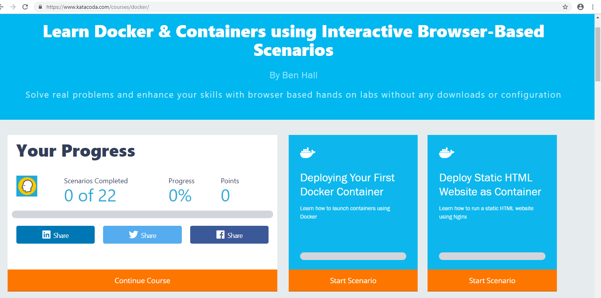

3. Klik Start Scenario
   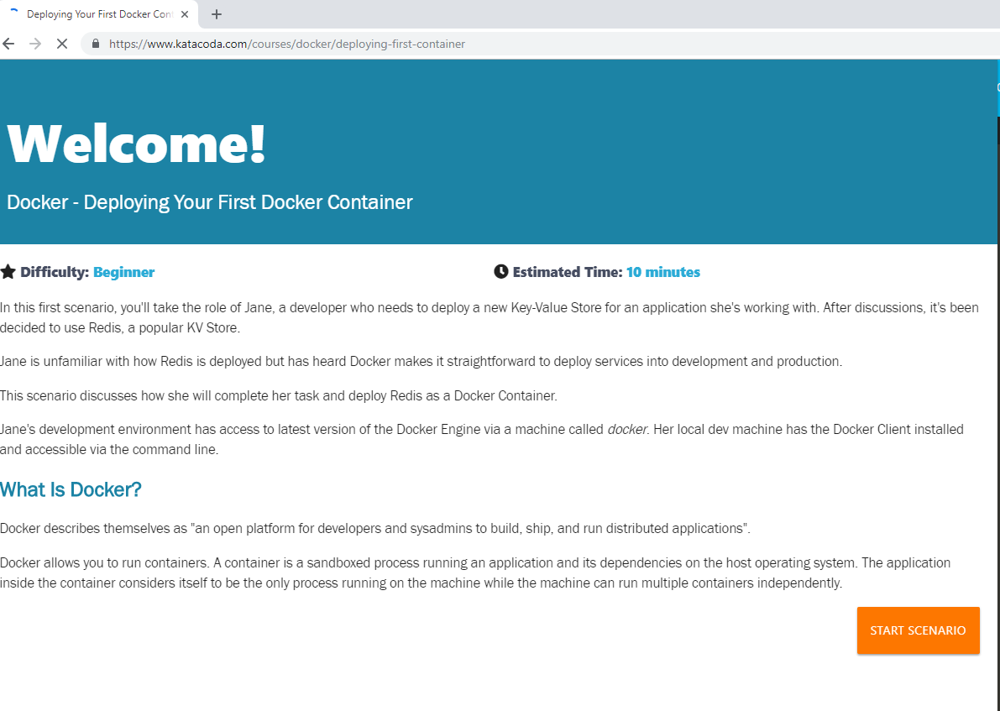

4. Kemudian mengetikan perintah ```docker search redis```

   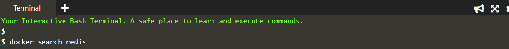

   Perintah di atas digunakan untuk mencari sebuah docker image untuk redis

5. Selanjutnya menjalankan docker image di background dengan mengetikan perintah ```docker run -d redis```

   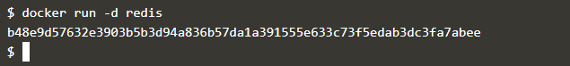

6. Setelah menjalankan docker image, untuk melihat container apa saja yang berjalan maka ketikan perintah ```docker ps```

   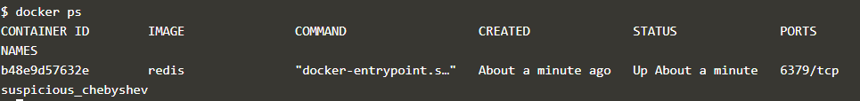

    terlihat pada gambar di atas informasi lengkap tentang cointainer yang berjalan

7. Langkah berikutnya adalah mengexpose container yang sudah berjalan  

   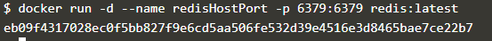

    Maksud dari sintaks di atas adalah akan menjalankan container redis di background dengan nama redisHostPort

8. Setelah menggunakan port -p hostport : container port, kali ini akan mencoba mengetikan hanya hostport saja yang diketikan 

    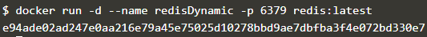

9. Untuk mengetahui port container nya dengan mengetikan perintah ```docker port redisDynamic 6379```

   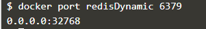

10. Untuk mengetahui cointainer yang berjalan ketikan perintah ```docker ps```

    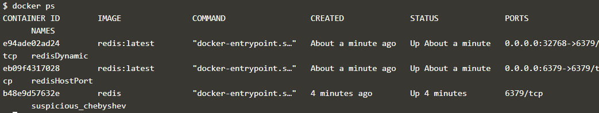

11. Selanjutnya akan menyimpan data di luar container yaitu di docker host

    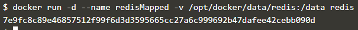

12. Selanjutnya menjalankan Ubuntu contianer sekaligus melihat prosesnya pada contianer.

    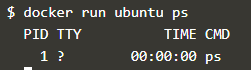

13. Untuk dapat mengakses bash dari dalam container maka ketikan perintah ```docker run -it ubuntu bash```.
 
    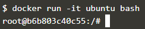

14. Maka course pertama untuk docer pada katacoda telah selesai
    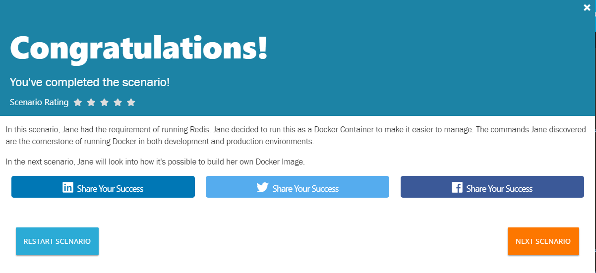


## Mendeploy website dan menggunakan nginx

Langkah - Langkah 

1. Yang harus pertama kali dilakukan adalah membuat dockerfile. Dockerfile digunakan untuk membuat image 

    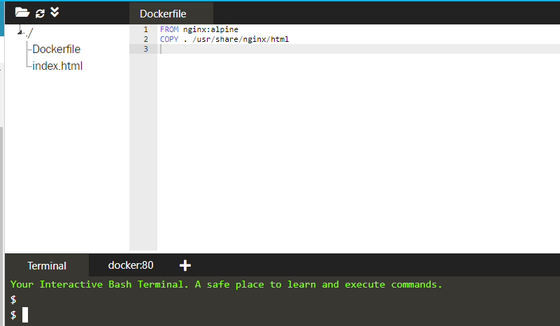
    
    Baris pertama mendifiniskan image sedangkan baris ke dua mengcopy content ke lokasi dalam container, sedangkan untuk index.html sendiri isinya adalah ```<html> Hello World </html>``` 

2. Buat html tersbut menjadi image menggunakan build command
   ```docker build -t webserver-image:v1 .```
   
3. Periksa image dengan menggunakan ```docker images```

    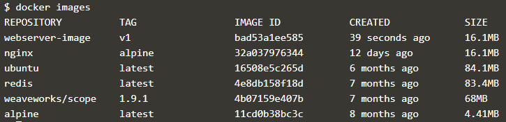

4. Launching image yang telah dibuat menggunakan nama dan tag yang mudah, dan dikarenakan sebagai webserver maka port yang digunakan adalah 80
   ```docker run -d -p 80:80 webserver-image:v1```

5. Akses dengan mengetikan perintah ```curl docker``` hasilnya
    
    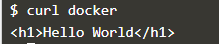

6. Akses juga bisa dilakukan melalui browser sesuai link yang sudah disediakan oleh katacoda maka hasilnya akan seperti di bawah ini
    
    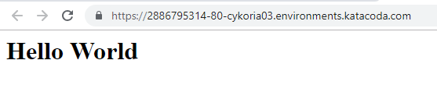

## Membuat Container Images

Langkah - Langkah 

1. Membuat dockerfile 
```bash
FROM nginx:1.11-alpine
COPY index.html /usr/share/nginx/html/index.html
EXPOSE 80
CMD ["nginx", "-g", "daemon off;"]
```

2. Selanjutnya membuat image dari dockerfile tersebut ```docker build -t my-nginx-image:latest```

    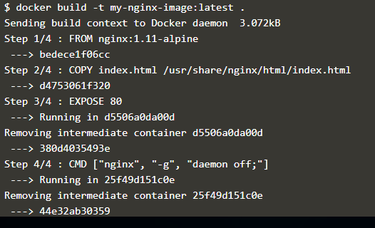

3. Image diperiksa apakah sudah ditambahkan dengan image yang dibuat tadi 
    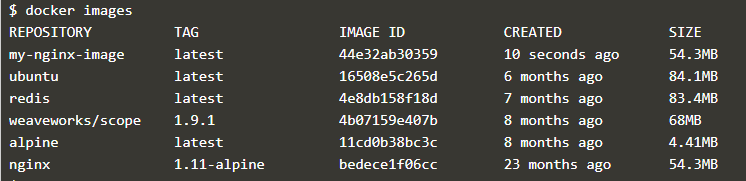

4. Jalankan image agar bisa diakses dengan perintah ```docker run -d -p 80:80 my-nginx-image:latest1```

5. Akses web server dengan perintah ```curl -i http://docker```

    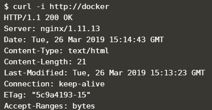

6. Periksa container yang sedang berjalan dengna perintah ```docker ps```

    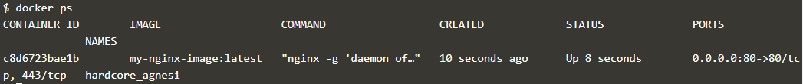

Maka Pengenalan docker mulai dari pertama kali mendeploy cointainer sampai membuat image telah selesai.

## Dwi Astuti