# Minggu 04

# Mengkoneksikan beberapa container di docker

Metode yang digunakan untuk mengkoneksikan antar container yang akan dibahas ada dua yaitu menggunakan links dan juga network. Untuk Setiap metode akan dibahas masing - masing.

## 1. Menghubunkan container menggunakan links.

Langkah - Langkah 

1.  Menjalankan redis. 
    Redis adalah sebuah database key-value data store. Untuk mempermudah pekerjaan ketika menggunakan links maka sangat penting memberi nama sumber container dengan nama yang mudah. Untuk nama container kali ini diberi nama redis-server. Perintah menjalankan container tersebut adalah ``` docker run -d --name redis-server redis```

    

2.  Membuat link
    Untuk mengkoneksikan ke sebuah container maka menggunakan pilihan ``` -link <container-name|id>:<alias>``` ketika menlaunching sebuah container baru. Kali ini akan menghubungkan Alpine container yang dihubungan dengan redis-server yang telah dibuat tadi. Perintah untuk menghubunkan dua container tersebut adalah ```docker run --link redis-server:redis alpine env```

    

3.  Menampilkan container yang ada di host
    Untuk memeriksa contianer yang terupdate pada host perintahnya adalah ``` docker run --link redis-server:redis alpine cat /etc/hosts``

    

    Perintah di atas dilakukan karena docker telah mengupdate container yang ada di host dengan tiga nama yaitu container asli, yang menggunakan alias dan hash-id

4.  Melakukan ping
    
    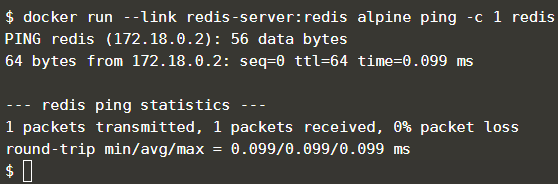

5.  Mengkoneksikan ke app
    Dengan menggunakan link, aplikasi dapat terhubung/terkoneksi dan berkomunikasi dengan sumber container. Untuk contohnya akan mengubungkan aplikasi node.js dengan redis 

    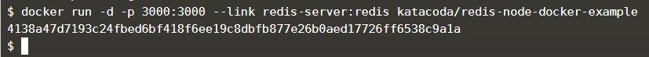

6.  Mencoba Koneksi

    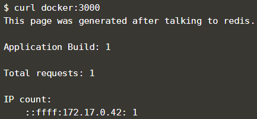

7.  Menghubungkan ke Redis CLI
    Perintah ```docker run -it --link redis-server:redis redis redis-cli -h redis`` akan menjalankan Redis-CLI tool dan terhubung dengan redis server melalui nama alias "its"

    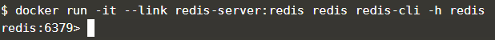

    Setelah muncul tampilan di atas ketikan perinta ```KEYS *``` makan akan ditampilkan contents stored terkini yang ada pada sumber redis container 
    
    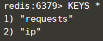

    untuk keluar dari Redis-CLI cukup dengan mengetikan perintah ```QUIT```

Maka mengkoneksikan/menghubungkan beberapa container dengan link sudah selesai.
Selanjutnya akan dibahas dengan menggunakan network.

## 2. Menghubungkan/Mengkoneksikan Container dengan Networks

Langkah - Langkah

1.  Membuat Network
    Pada contoh ini akan memulai membuat sebuah backend-network. Semua container yang terikat ke backed akan berada pada network ini. Untuk membuat network backend-network ketikan perintah ```docker network create backend-network```
    
    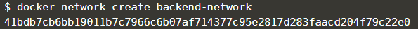

2.  Connect ke Network
    Ketika melaunching container baru, kita dapat menggunakan -net attribute untuk menandai network key harus dikoneksikan. Perintah yang digunakan adalah ```docekr run -d --name=redis --net=backed-network redis```

    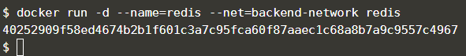

3.  Melihat enviroment variables atau update host file container.
    Berbeda dengan menggunakan links, docker network berlaku seperti network tradisional yang mana nodes dapat menempel atau terpisah. Untuk memeriksanya maka perintah pertama yang digunakan adalah ```docker run --net=backend-network alpine env```

    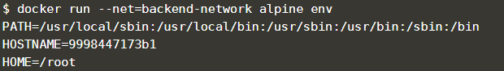

    selanjutnya ketikan perintah ```docker run --net=backend-network alpine cat /etc/hosts```

    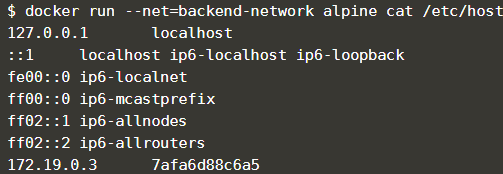

4.  Mensetting DNS Server di resov.conf

    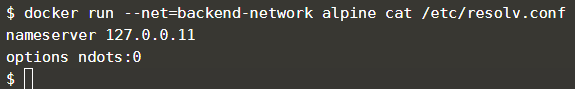

5.  Melakukan perintah ping

    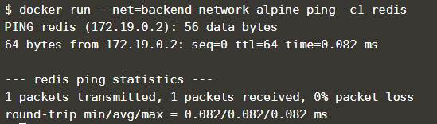

6.  Menghubungkan dua container
    pertama buat network baru seperti pada langkah pertama dengan nama fronted-network ```docker network create frontend-network```

    Kemudian menghubungkan frontend-network dengan redis dengan mengetikan perintah ```docker network connect frontend-network redis```

7.  Menjalankan web server

    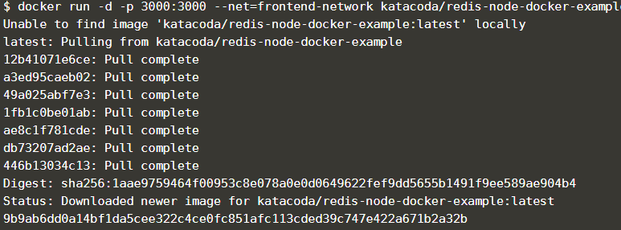

8.  Mencoba menggunakan perintah ```curl docker:3000```

    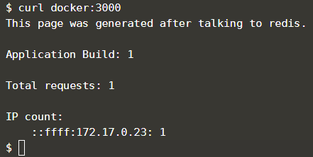

9.  Membuat Alias
    Dibuat sebuah network dengan nama frontend-network2 dengan perintah ```docker network create frontend-network2```
    Setelah itu akan menghubungkan frontend-network2 dengan alias dari db dengan perintah ``` docker network connet --alias db frontend-network2 redis```

10. Melakukan ping
    Ketika container akan mengakses sebuah service melalui db, dia akan memberikan ip address Redis container.

    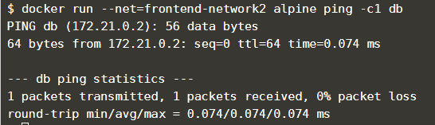

11. Mengexplore network
    Melihat network dengan mengetikan perintah ```docker network ls```
    Setelah itu dapat mengexplore network untuk melihat container dan ip addres yang digunakan dengan mengetikan perintah ``` docker network inspect frontend-network```

    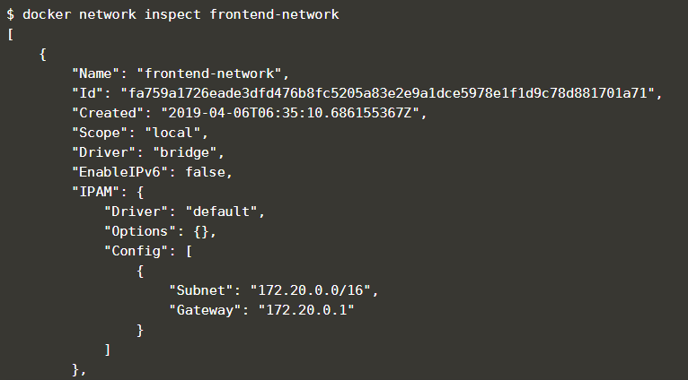

12. Mengkahiri network
    Untuk mengakhiri atau memutus hubungan antara redis dan frontened-network maka perintahnya ```docker network disconnect frontend-network redis```

Selesai sudah contoh koneksi antar container menggunakan network.

### by dwast


