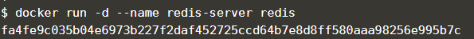
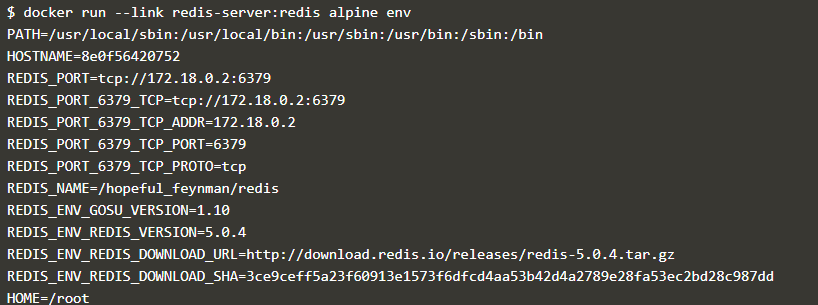
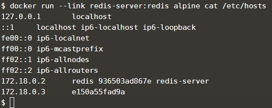

# Minggu 04

# Mengkoneksikan beberapa container di docker

Metode yang digunakan untuk mengkoneksikan antar container yang akan dibahas ada dua yaitu menggunakan links dan juga network. Untuk Setiap metode akan dibahas masing - masing.

## 1. Menghubunkan container menggunakan links.

Langkah - Langkah 

1.  Menjalankan redis. 
    Redis adalah sebuah database key-value data store. Untuk mempermudah pekerjaan ketika menggunakan links maka sangat penting memberi nama sumber container dengan nama yang mudah. Untuk nama container kali ini diberi nama redis-server. Perintah menjalankan container tersebut adalah ``` docker run -d --name redis-server redis```

    

2.  Membuat link
    Untuk mengkoneksikan ke sebuah container maka menggunakan pilihan ``` -link <container-name|id>:<alias>``` ketika menlaunching sebuah container baru. Kali ini akan menghubungkan Alpine container yang dihubungan dengan redis-server yang telah dibuat tadi. Perintah untuk menghubunkan dua container tersebut adalah ```docker run --link redis-server:redis alpine env```

    

3.  Menampilkan container yang ada di host
    Untuk memeriksa contianer yang terupdate pada host perintahnya adalah ``` docker run --link redis-server:redis alpine cat /etc/hosts``

    

    Perintah di atas dilakukan karena docker telah mengupdate container yang ada di host dengan tiga nama yaitu container asli, yang menggunakan alias dan hash-id

4.  Melakukan ping
    
    

5.  Mengkoneksikan ke app
    Dengan menggunakan link, aplikasi dapat terhubung/terkoneksi dan berkomunikasi dengan sumber container. Untuk contohnya akan mengubungkan aplikasi node.js dengan redis 

    

6.  Mencoba Koneksi

    

7.  Menghubungkan ke Redis CLI
    Perintah ```docker run -it --link redis-server:redis redis redis-cli -h redis`` akan menjalankan Redis-CLI tool dan terhubung dengan redis server melalui nama alias "its"

    

    Setelah muncul tampilan di atas ketikan perinta ```KEYS *``` makan akan ditampilkan contents stored terkini yang ada pada sumber redis container 
    
    

    untuk keluar dari Redis-CLI cukup dengan mengetikan perintah ```QUIT```

Maka mengkoneksikan/menghubungkan beberapa container dengan link sudah selesai.
Selanjutnya akan dibahas dengan menggunakan network.