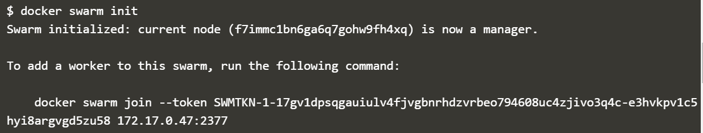

# Minggu 06

# Docker Swarm

Docker swarm digunakan untuk membantu manajemen docker pada multiple host, dengan menggunakan docker swarm dapat membuat clustering dan juga penjadwalnya. Untuk melihat command - command yang dapat menggunakan perintah di bawah ini 

(images/swarm_1.png)

Langkah - Langkah 

1.  Initialise Swarm Mode 
    
    

2.  Defining Settings
    
    Docker Compose mensupport semua properti yang diperlukan dengan menggunakan ```docker run```

    

    ```docker-compose``` membuat link ke container ```redis``` dan akan mengexpose port 3001
    
3.  Defining Second Container
    
    Kita akan menambahkan container yang digunakan, caranya tinggal menambahkan saja container yang akan ditambahkan pada ```docker-compose``` di baris bawahnya.

    

    Pada file ```docker-compose``` di atas menambahkan service sehingga akan ada dua service yaitu web dan redis.

4.  Docker Up
    
    Setelah membuat ```docker-compose``` kita bisa menjalankan service yang telah didefinisakan pada file ```docker-compose``` tersebut dengan cara mengetikan perintah ```docker-compose up -d```. ```-d``` berati container akan berjalan di background setelah container selesai di build.

    

5.  Docker Management
    
    Selain untuk menjalankan multiple container, ```docker-compose``` bisa digunakan untuk mengatur service yang dijalankan.

    ```docker-compose ps``` perintah ini digunakan untuk detail container 

    

    ```docker-compose logs``` digunakan untuk melihat log aplikasi yang dijalankan menggunakan ```docker-compose```

    

    Untuk melihat perintah apa saja yang digunakan dalam docker compose maka ketikan perintah ```docker compose```

    

6.  Docker Scale
    
    Yang dimaksud dengan docker scale di sini adalah docker-compose digunakan untuk mengatur jumlah container yang akan dijalankan.

    

    Pada saat membuat service tutorial pada docker-compose jumlahnya adalah 1 akan tetapi perintah di atas menghendaki jumlah scale 3 sehingga docker-compose akan menambahkan.

    Berikutnya akan membuat scale lebih sedikit dari jumlah service

    

    Terlihat dari gambar di atas bahwa ketika mengetikan scale 1 maka service ke dua dan ketiga akan dihentikan dan dihapus.

7.  Docker Stop
    
    Untuk menghentikan service yang dijalankan menggunakan ```docker-compose``` digunakan perintah ```docker-compose stop```

    


### by dwast


