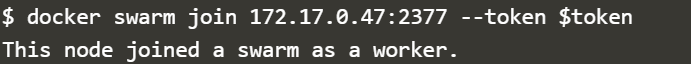

# Minggu 06

# Docker Swarm

Docker swarm digunakan untuk membantu manajemen docker pada multiple host, dengan menggunakan docker swarm dapat membuat clustering dan juga penjadwalnya. Untuk melihat command - command yang dapat menggunakan perintah di bawah ini 


Langkah - Langkah 

## 1.  Initialise Swarm Mode 
    
  

   Command ```docker swar init``` digunakan untuk menginisialisasi docker host menjadi multiple docker host dengan demikian docker engine dapat digunakan untuk clustering dan berlaku sebagai manager. Selain itu command ini akan menghasilkan token yang digunakan untuk menambahkan node ke cluster.

## 2.  Join Cluster
    
   Cara mendapatkan token adalah mananyakan ke manager yang sudah berjalan via ``` swarm join-token`` dengan mengetikan command 

   

  setelah mendapatkan token dan disimpan pada variabel $token kemudian dapat digunakan untuk mendaftarkan host yang baru sebagai worker. Manager akan menerima node baru yang ditambahkan ke dalam cluster

   

   Kemudian diperiksa apakah node bertambah atau tidak dengan mengetikan command ```docker node ls```

   

## 3.  Create Overlay Network
    
   Overlay network dibuat agar container - container pada host yang lain dapat saling berkomunikasi. Virutal Extensible Lan (VXLAN) dirancang untuk cloud skala besar.

   

   Command di atas akan membuat overlay network baru dengan nama skynet. Semua containers yang terhubung ke network ini dapat saling berkomunikasi.

## 4.  Deploy Service
    
   

   Pada contoh ini docker image dibuat network skynet baru dengan nama katacoda/docker-http-server. Didefinisikan nama service adalah http kemudian di replica menjadi dua service setelah itu dilakukan load balance untuk service tersebut yang berjalan di port 80. Dengan demikian node yang menerima request bukan node yang menerima, akan tetapi docker load balances melakukan request ke semua container yang tersedia di dalam cluster.
   Untuk memeriksa apakah service dapat menggunakan command ``docker service ls``

   

   Selanjutnya periksa contianer pada host1 atau pada host manager
   
   

   Periksa juga container pada worker

   

   Kemudian periksa docker service dengan ```curl```

   

   Untuk memeriksa Container ID digunakan command ```docker service http```

   

## 5. Inspect State

    Kita dapat juga melihat detail dan konfigurasi servic

   

   Setiap node dapat diperiksa node mana yang sedang berjalan

   

   Dari command tersebut dapat didapatkan informasi status nodevsaat ini dan status node yang seharusnya (desired state). Jika status saat itu tidak sesuai yang diharapkan, field error akan terisi jenis errornya.

   Selanjutnya menambahkan ID node pada command di atas

   

   Untuk melihat service mana yang merespon request dapat menggunakan perintah ```curl```.

   

   Pada gambar di atas terlihat bahwa serice id yang merespon berbeda dengan sebelumnya dikarenakan dengan sistem load balancing, service akan mengirimkan request ke semua container yang berjalan pada cluster.

## 6. Scale Service
   
   Scale service adalah sebuah service pada docker yang mengizinkan melakukan scale up dari task yang berjalan pada cluster

   

   Command di atas akan membuat http service berjalan sebanyak 5 containers. Sedangkan untuk melihat masing - masing host dapat menggunakan command ```docker ps```
   
   

   Pada gambar di atas terlihat untuk setiap host terlihat ada penambahan node.

   Untuk melihat hasilnya dapat menggunakan perintah ```curl```
   
   


### by dwast


