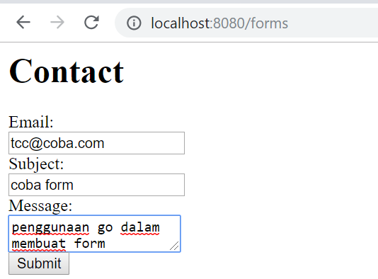

# Form di Go

Pada dasarnya pembuatan form di go kali ini tidak jauh beda dengan yang ada pada php, yaitu pertama dibuat form html yang digunakan untuk menginputkan data kemudian dibuat file go untuk merespon request dari form html tersebut. Source code untuk forms.html :


Kemudian dibuat file go dengan nama forms.go yang digunakan untuk merespond request :
```bash
// forms.go
package main

import (
	"html/template"
	"net/http"
)

type ContactDetails struct {
	Email   string
	Subject string
	Message string
}

func main() {
	tmpl := template.Must(template.ParseFiles("forms.html"))

	http.HandleFunc("/", func(w http.ResponseWriter, r *http.Request) {
		if r.Method != http.MethodPost {
			tmpl.Execute(w, nil)
			return
		}

		details := ContactDetails{
			Email:   r.FormValue("email"),
			Subject: r.FormValue("subject"),
			Message: r.FormValue("message"),
		}

		// do something with details
		_ = details

		tmpl.Execute(w, struct{ Success bool }{true})
	})

	http.ListenAndServe(":8080", nil)
}
```
ada dua package yang diimport yaitu `html/template` dan `net/http`. Setelah itu dibuat tiga variabel bertipe data string yang digunakan untuk menampung data yang diinputkan melalui form html yaitu Email, Subject dan Message.
Code `tmpl := template.Must(template.ParseFiles("forms.html"))` bahwa template yang digunakan adalah forms.html yang sudah dibuat sebelumnya tadi.

Sedangkan untuk handler request nya adalah dengan code :
```bash
http.HandleFunc("/", func(w http.ResponseWriter, r *http.Request) {
		if r.Method != http.MethodPost {
			tmpl.Execute(w, nil)
			return
		}
```
Kemudian akan dieksekusi dengan code ```tmpl.Execute(w, struct{ Success bool }{true})```.
Untuk kali ini port yang akan digunakan adalah 8080 sehingga untuk mengakses forms tersebut diketikan pada browser ```http://localhost:8080/forms```


dan diketikan pada tag input



Setelah disubmit hasilnya 


