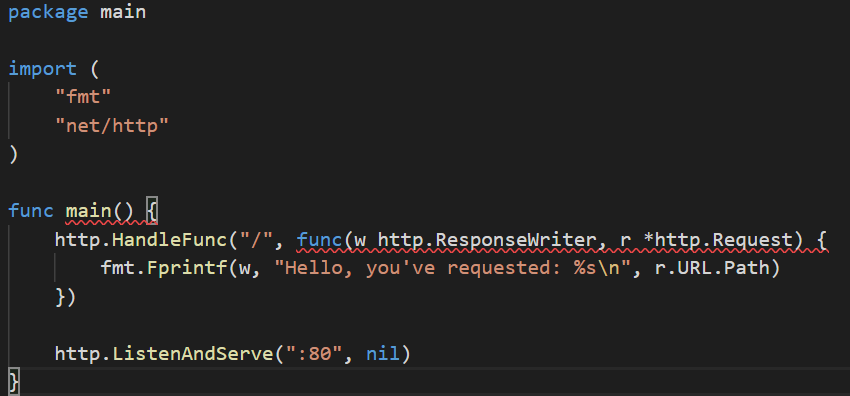
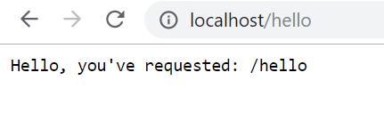

# HelloWorld

Didalam go sudah terdapat Bahasa Pemrograman dan web service yang langsung dapat dijalankan. Golang menyediakan package ```net/http```, berisi berbagai macam fitur tentang HTTP Protocol seperti routing, server, templating, dan sebagainya. Untuk source code hello.go adalah 



Package yang perlu diimport adalah ```ftm``` dan ``http/net``. Kemudian dibuat handler untuk menerima semua koneksi HTTP yang masuk dari browser, HTTP clients atau API request.
```http.ResponseWriter``` digunakan untuk merespon text/html yang dituliskan, sedangkan ```http.Request``` berisi informasi tentang HTTP request seperti URL dan header files.

```http.ListenAndServe(":80", nil)``` berarti port yang akan digunakan adalah port 80.
Untuk menjalankan go maka pada terminal perlu mengetikan perintah ```go run``
Pada browser diketikan url ```localhost/hello``` dan hasilnya



