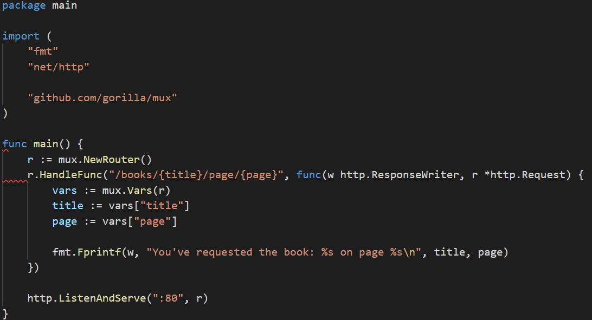
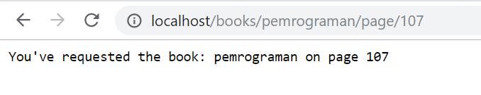

# Routing di Go

Routing kali ini akan menggunakan package ```gorilla/mux``` , fungsi dari package tersebut di antaranya adalah membuat routing dengan parameter `GET` dan `POST`. Untuk dapat menggunakan `gorilla/mux` maka download di github dengan cara mengetikan perintah ```go get -u github.com/gorilla/mux```. 
Berikut contoh source code route di go



pada route kali ini ada tiga package yang diimport yaitu `fmt` `net/http` dan `gorilla/mux`.

Pada handler fungsi `http.HandleFunc()` dengan route `"/books/{title}/page/{page}"` yang mana {title} dan {page} merupakan variabel yang dapat diisikan oleh user.
Kemudian hasilnya akan ditampilkan melalui `fmt.Fprintf()`.
Uji program dengan mengetikan url `http://localhost/books/pemrograman/page/107` dan hasilnya adalah :




