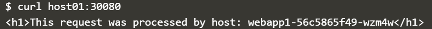

# minggu-08
# Kubernet

Kubernetes adalah platform open-source berbasis Linux yang dirancang untuk mengotomatisasi penempatan, penskalaan, dan manajemen aplikasi yang berada dalam kontainer. Dengan Kubernetes, Anda dapat dengan cepat dan efisien menanggapi permintaan pelanggan.
Untuk mendeploy container akan digunakan dua cara yaitu menggunakan kubectl dan YAML.

## Kubetcl
1. Untuk memulainya perlu me-launch sebuah kubernet cluster dengan mengetikan command `minikube start`


Kemudian periksa nodes yang siap digunakan dengan mengetikan perintah `kubetcl get nodes`


Terlihat dari gambar di atas bahwa minikube siap untuk digunakan dan versinya adalah v1.13.3

2. Setelah itu jalankan kubectl, untuk menjalankannya menggunakan perintah `kubetcl run <name of deployment><properties>`


images yang dijalankan adalah diambil dari `katacoda/docker-http-server:latest`

untuk melihat status dari deployment dapat menggunakan perintah `kubetcl get deployments`


Dari gambar di atas terlihat bahwa http siap untuk digunakan.

Untuk melihat proses deployment secara rinci dapat menggunakan perintah `kubetcl describe deployment http`


3. Kubectl Expose
Untuk mengekspose service ke sebuah port sehingga dapat diakses dapat menggunakan perintah `kubetcl expose`


Maksud dari perintah di atas adalah akan mengekspose container pada mesin menggunakan port 80 sedangan untuk external-ip menggunakan port 8080, Sehingga apabila akan mengkases perlu menambahkan 8080 setelah ip 172.17.0.15.
Untuk memeriksanya dapat dilakukan dengan cara ping ke mesin dengan mengetikan perintah `curl http://172.17.0.15:8080`


4. Jalankan dan Expose Kubetcl
Untuk membuat service http kedua pada port 8001 dapat menggunakan perintah di bawah ini


Untuk melihat apakah service kedua berhasil dapat menggunakan perintah `curl`


Dengan peritah `kubetcl get svc` maka service tidak dapat muncul .


Untuk melihat detailnya dapat menggunakan perintah `docker ps | grep httpexposed`


5. Scale Containers
Setelah Service berjalan, kita dapat mengatur berapa pods yang akan dijalankan.


Dengan demikian pods yang akan dijalankan adalah 4, dapat dilihat dengan perintah `kubetcl get pods`


Masing - masing pod akan ditambahkan ke dalam load balancer, dengan perintah `kubetcl describe svc http` akan ditampilkan diskripsi lengkap tentang pods 


Kemudian test mengunggankan perintah `curl`


## Deploy Container Using YAML Definitions
Salah satu yang paling umum pada object kubernets adalah deployment objectnya. Deployment object menjelaskan spesifikasi container yang diinginkan, berserta nama dan label yang digunakan dari bagian lain kubernets untuk saling terkoneksi. Semua object - object yang diinginkan dalam disimpan sebuah file `yaml`. 

1. Create Deployment
Buat sebuah file `yaml` dengan nama `deployment.yaml` :

```bash
apiVersion: extensions/v1beta1
kind: Deployment
metadata:
  name: webapp1
spec:
  replicas: 1
  template:
    metadata:
      labels:
        app: webapp1
    spec:
      containers:
      - name: webapp1
        image: katacoda/docker-http-server:latest
        ports:
        - containerPort: 80
```
Kemudian di-deploy dengan menggunakan perintah :


container webapp1 sudah di-deploy sesuai dengan yang diketikan pada file `deployment.yaml`. dan untuk memastikan deployment berjalan dapat menggunakan perintah `kubectl get deployment`


Sedangkan untuk melihat secara rinci dapat menggunakan perintah `kubetcl describe deployment webapp1`


2. Create Service
Kubernets mempunyai kapasitas networking yang powerful yang mengontrol bagaimana aplikasi saling berkomunikasi. Konfigurasi networking dapat juga dikontrol melalui YAML, untuk itu dibuat sebuah file `service.yaml` :

```bash
apiVersion: v1
kind: Service
metadata:
  name: webapp1-svc
  labels:
    app: webapp1
spec:
  type: NodePort
  ports:
  - port: 80
    nodePort: 30080
  selector:
    app: webapp1
```

Delpoy service dengan menggunakan perintah `kubectl create -f service.yaml`


Untuk melihat diskripsi tentang service dapat menggunakan perintah `kubetcl get svc`


Sedangkan untuk melihat informasi lebih detail dapat dilakukan seperti gambar di bawah ini :


Test dengan menggunakan perintah `curl`



3. Scale Deployment

Untuk menambahkan service maka dapat mengubah isi pada file `deployment.yaml` yaitu dengan mengubah jumlah replicas yang tadinya `replicas : 1` menjadi `replicas : 4` setelah mengubahnya deploy ulang dengan perintah `kubetcl apply -f deployment.yaml`


Periksa jumlah replika dengan perintah `kubetcl get deployment `


Periksa jumlah pods


Test menggunakan perintah `curl`


## Dwast


